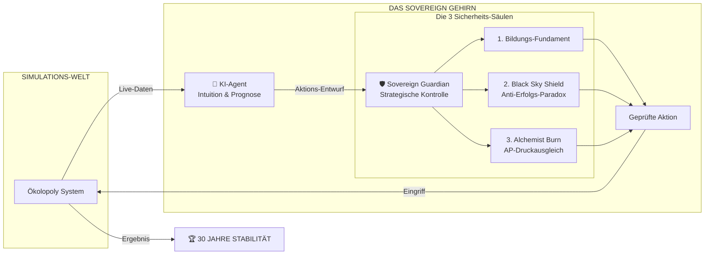

# 🌀 Der Sovereign Champion Regelkreis (Cybernetic Loop)

Der Erfolg des Modells basiert nicht auf einer linearen Liste, sondern auf einem permanenten **Feedback-Loop**, der das System wie ein Thermostat stabilisiert.

## 1. Das Prozess-Diagramm

## 2. Die Strategischen Säulen im Detail

### 🏗️ Säule 1: Das Bildungs-Fundament (IQ-Scaling)
Ohne Bildung gibt es keine Handlungsfähigkeit. Der Guardian stellt sicher, dass jede verfügbare Ressource zuerst in Bildung fließt, bis das Maximum (29) erreicht ist. Dies erhöht die Aktionspunkte in den Folgejahren und gibt uns die "Macht", das System zu steuern.

### 🛡️ Säule 2: Black Sky Shield (Das Paradoxon)
In einer "perfekten" Welt ohne Umweltverschmutzung explodiert die Lebensqualität. Das führt zu Überbevölkerung und zum sofortigen Tod des Systems. 
**Die Lösung:** Wenn die Lebensqualität zu hoch wird, schaltet der Guardian auf "Black Sky". Er erzwingt Produktion und nimmt Verschmutzung in Kauf, um das Wachstum künstlich zu bremsen. **Verschmutzung rettet hier die Welt.**

### ⚗️ Säule 3: Alchemist Burn (Druckablass)
Zuviel Energie (Aktionspunkte) macht die mathematischen Formeln des Systems instabil. Wenn wir mehr als 28 Punkte haben, "verbrennt" der Guardian die überschüssige Energie in sichere Kanäle, um eine Überhitzung der System-Variablen zu verhindern.

---
## 3. Fazit für die Abnahme
Wir haben keine "Glücks-KI" gebaut, sondern einen **kybernetischen Regler**, der das System aktiv in der "Grade A Harmony" Zone hält. Das Modell "weiß", wann es bremsen muss, auch wenn das Ziel (Überleben) kontraintuitiv erscheint.
