# 🌳 Oekolopoly Sovereign Hybrid Champion: Architectural Mindmap

This document visualizes the complete "Sovereign Hybrid" architecture, combining exhaustive mathematical search with recurrent reinforcement learning.

```mermaid
graph TD
    Root["👑 SOVEREIGN HYBRID CHAMPION"] --> Phase1["📡 PHASE 1: Omni-Search (The Solver)"]
    Root --> Phase2["💾 PHASE 2: Data Synthesis (The Knowledge)"]
    Root --> Phase3["🤖 PHASE 3: RL Training (The Muscle)"]
    Root --> Infra["🏗️ INFRASTRUCTURE (The Foundation)"]

    %% Phase 1 Details
    Phase1 --> BS["Exhaustive Beam Search (Width=5000)"]
    Phase1 --> SBP["Stars-and-Bars Partitioning (Step=1/4)"]
    Phase1 --> AH["Adaptive Heuristics (Gemini Brainstorming)"]
    Phase1 --> CG["Cybernetic Governor (Reward Shaping)"]
    
    CG --> CG1["Hard Penalty: Production > 16"]
    CG --> CG2["Hard Pruning: Environment < 14"]
    CG --> CG3["Edu 28 Mastery (Extra Points Focus)"]

    %% Phase 2 Details
    Phase2 --> GP["'Golden Path' Trajectory (30-Year Record)"]
    Phase2 --> EQ["Equilibrium State Identification"]
    Phase2 --> BC_Data["Expert Trajectories for Behavior Cloning"]

    %% Phase 3 Details
    Phase3 --> RPPO["RecurrentPPO (LSTMs for Temporal Memory)"]
    Phase3 --> BC["Behavior Cloning (Warm-start from Golden Path)"]
    Phase3 --> HDR["Homeostatic Drive-Reduction Reward"]

    %% Infra Details
    Infra --> OABW["OekoActionBuilderWrapper (Math Constraints)"]
    Infra --> HRV3["HomeostaticRewardV3 (Stability Focus)"]
    Infra --> WP["wrappers.py (Safety & Clipping Logic)"]
    Infra --> Standalone["Standalone SOTA Build (No Dependencies)"]

    %% Styles
    style Root fill:#f9f,stroke:#333,stroke-width:4px
    style Phase1 fill:#bbf,stroke:#333,stroke-width:2px
    style Phase2 fill:#bfb,stroke:#333,stroke-width:2px
    style Phase3 fill:#fbb,stroke:#333,stroke-width:2px
    style Infra fill:#eee,stroke:#333,stroke-dasharray: 5 5
```

## 🛠️ Kern-Vorteile dieser Architektur

1. **Präzision**: Durch den *Omni-Search* überlassen wir den Start des Spiels nicht dem Zufall, sondern berechnen mathematisch den stabilsten Einstieg.
2. **Gedächtnis**: Das *RecurrentPPO* (LSTMs) erkennt schleichende Trends in der Simulation, die eine normale KI übersehen würde.
3. **Sicherheit**: Der *Cybernetic Governor* verhindert den berüchtigten "Year 12 Trap", indem er physikalische Grenzwerte der Simulation (wie Box 5/Umwelt) hart erzwingt.
4. **Effizienz**: Der *OekoActionBuilderWrapper* sorgt dafür, dass die KI nur über gültige Spielzüge nachdenkt – 100% der Rechenpower fließt in die Strategie.
