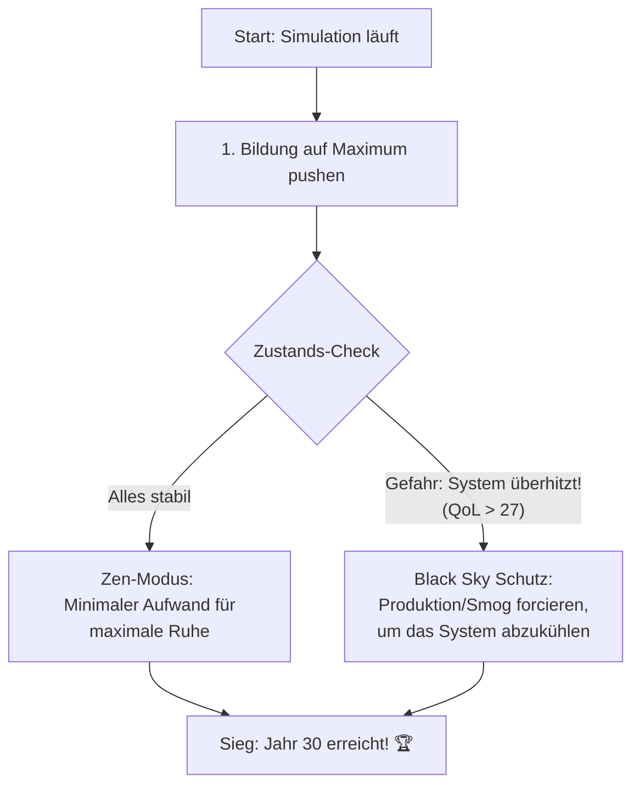

# 🌟 Sovereign Champion: Einfach erklärt

Dieser Flowchart zeigt die Kern-Logik, die unseren 30-Jahre-Erfolg garantiert.

### Die goldene Regel:
Um 30 Jahre zu überleben, darf die Welt nicht "zu perfekt" sein. Wenn es zu sauber ist, explodiert die Bevölkerung und alles bricht zusammen. Unser Modell nutzt **kontrollierte Verschmutzung (Smog)** als Bremse, um das Überleben der Menschheit zu sichern.
