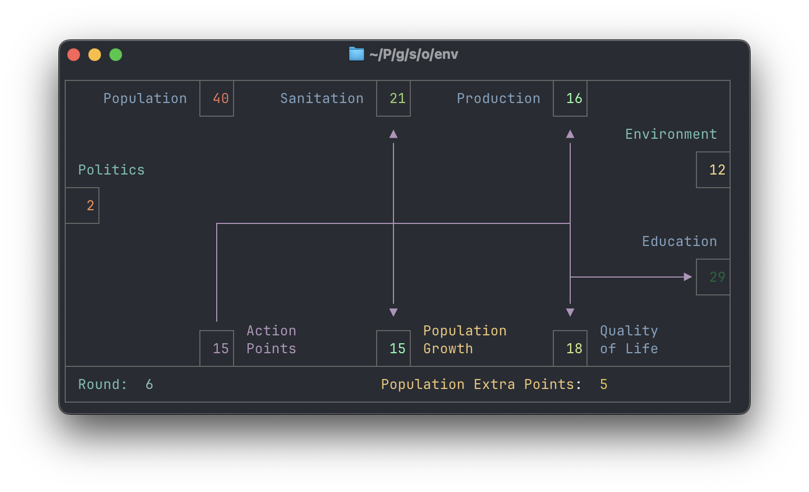

# GYMCTS-Games


## Description
This project applies the library `gymcts` to the FrozenLake environment and the Ökolopoly game.

The packages `frozenlake` and `oekolopoly` in the `src` directory provide standalone example scripts for the respective environments, including implementations of RL, MCTS, and NMCTS approaches.

The `experiments` package contains adapted versions of these scripts with integrated Weights & Biases tracking.

## State of the Project

This project serves as supplementary material for a scientific publication and will not be further developed.
I will respond to issues and questions until the end of 2027.

## Quickstart
A minimalistic MCTS example for Ökolopoly:

```
from gymcts.gymcts_agent import GymctsAgent
from gymcts.gymcts_action_history_wrapper import ActionHistoryMCTSGymEnvWrapper

from oekolopoly.env.oeko_env import OekoEnv, OekoActionBuilderWrapper

if __name__ == '__main__':
    env = OekoEnv(render_mode="ansi")
    env = OekoActionBuilderWrapper(env, auxilary_reward=True)
    obs, _ = env.reset()

    def action_mask_fn(env: OekoActionBuilderWrapper):
        return env.env.valid_action_mask()

    env = ActionHistoryMCTSGymEnvWrapper(env, action_mask_fn=action_mask_fn)

    env.reset()

    # 2. create the agent
    agent = GymctsAgent(
        env=env,
        clear_mcts_tree_after_step=True,
        render_tree_after_step=True,
        number_of_simulations_per_step=3_000,
        exclude_unvisited_nodes_from_render=True
    )

    # 3. solve the environment
    actions = agent.solve()
```

## Ökolopoly Visualization
We have adapted the render function to provide a console-based visualization, allowing the environment state to be 
observed in the logs (for example, when running on a server).




## Additional Material
Originally, I planned to compare the RL, MCTS, and NMCTS approaches with human baselines.
A collection of human gameplay records can be found in `resources/Human-games.pdf`. 
These are archived notes from the childhood of a friend of mine, who later became a competitive *Magic: The Gathering* player at the European level. 
As such, they may provide a reasonably strong baseline for comparison.
Due to time constraints, I was unable to analyze this data further. 
I have included it here in case others find it useful.

## Development Setup

If you want to check out the code and implement new features or fix bugs, you can set up the project as follows:

### Clone the Repository

clone the repository in your favorite code editor (for example PyCharm, VSCode, Neovim, etc.)

using https:
```shell
git clone https://github.com/Alexander-Nasuta/gymcts-games.git
```
or by using the GitHub CLI:
```shell
gh repo clone Alexander-Nasuta/gymcts-games
```

if you are using PyCharm, I recommend doing the following additional steps:

- mark the `src` folder as source root (by right-clicking on the folder and selecting `Mark Directory as` -> `Sources Root`)
- mark the `resources` folder as resources root (by right-clicking on the folder and selecting `Mark Directory as` -> `Resources Root`)


### Create a Virtual Environment (optional)

Most Developers use a virtual environment to manage the dependencies of their projects. 
I personally use `conda` for this purpose.

When using `conda`, you can create a new environment with the name 'my-graph-jsp-env' following command:

```shell
conda create -n gymcts-games python=3.11
```

Feel free to use any other name for the environment or an more recent version of python.
Activate the environment with the following command:

```shell
conda activate gymcts-games
```

Replace `gymcts` with the name of your environment, if you used a different name.

You can also use `venv` or `virtualenv` to create a virtual environment. In that case please refer to the respective documentation.

### Install the Project in Editable Mode

To install the project in editable mode, run the following command:

```shell
pip install -e .
```

This will install the project in editable mode, so you can make changes to the code and test them immediately.


## Contact

If you have any questions or feedback, feel free to contact me via [email](mailto:alexander.nasuta@wzl-iqs.rwth-aachen.de) or open an issue on repository.
